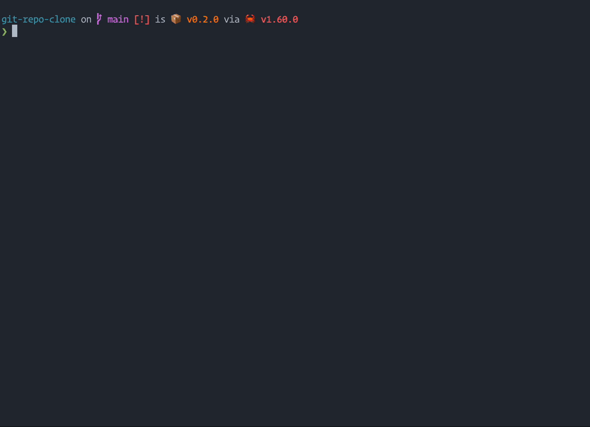

# git-repo-clone (grc)

The correct way to clone a git repository

## What is grc?

Git Repo Clone is a tool that leverages the power of fuzzy finding with searches
on the Github API. This allows for finding the exact repository you're looking
for even if you don't know the exact name of the repo or owner and then fuzzing
finding on those results.


(Note: The gif is out of date. The way to pass git flags is now by prefacing them wiht `-g` as shown in the help menu)

## Usage

Git must be installed. Use `grc --help`
```
USAGE:
    grc [OPTIONS] [repository] [SUBCOMMAND]

ARGS:
    <repository>    The repository name to search for

OPTIONS:
    -g, --git <git args>...             All additional git args. After all other options pass `-g`
                                        and then the git args. Eg `grc rust -g --bare`
    -h, --help                          Print help information
    -l, --limit <limit>                 The number of repositories to query and list: default=30
    -n, --new <new name>                A custom name for renaming the repository
    -o, --owner <owner>                 The owner account to search through
    -O, --ownersearch <owner search>    Search for an owner if the exact name isn't known and get
                                        their repos
    -p, --path <path>                   The full path to the parent folder to clone into
    -V, --version                       Print version information

SUBCOMMANDS:
    default-config    Configure your defaults
```

### Configuring defaults

```
USAGE:
    grc default-config --username <username> --path <clone path>

OPTIONS:
    -h, --help                   Print help information
    -p, --path <clone path>      The default path to clone repositories into when none is specified.
                                 If this is blank and none is specified it will clone into the
                                 current folder
    -u, --username <username>    The default username to search for when no other search parameters
                                 are given
```

## Installation

### Cargo

Install with `cargo install git-repo-clone` or

### From source

Clone the repository and install using ```cargo install --path . --force```
